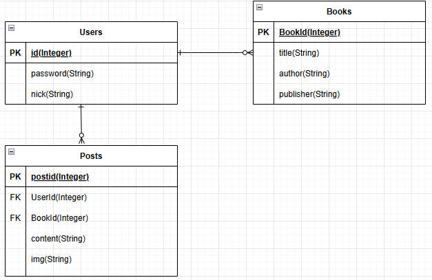

### booknote-platform
**사용자가 읽은 책의 감상문을 남길 수 있는 개인 독서 기록 플랫폼**
- 사용자가 읽은 책의 정보를 입력하고 감상문을 등록하여 다른 사람들과 공유할 수 있다.

### 기술 스택
- Backend: Node.js, Express.js
- Frontend: EJS (Embedded JavaScript Templates)
- ORM: Sequelize
- Database: MySQL
- Auth: express-session
- File Upload: Multer

### E-R 다이어그램

### 주요 기능
| 기능 | 설명 |
|------|------|
| **도서 감상문 작성** | 책 제목, 저자, 출판사 정보를 입력하고 감상문을 작성하며 이미지도 첨부 가능 |
| **회원가입 및 로그인** | 사용자는 ID와 비밀번호로 회원가입 후 세션 기반 로그인 가능 |
| **닉네임 및 비밀번호 변경** | 사용자 설정 페이지에서 닉네임 및 비밀번호 변경 가능 |
| **게시글 업로드** | 감상문을 작성하여 데이터베이스에 저장하고 메인 페이지에 공유 |
| **게시글 목록 보기** | 메인 페이지에서 모든 사용자들의 감상문 확인 가능 |
| **내 게시글 관리** | 작성한 게시글만 필터링하여 수정 또는 삭제 가능 (권한 체크 포함) |
| **이미지 업로드** | 책 표지 이미지 등 사용자 첨부 이미지 파일 업로드 지원 (Multer 사용) |

### 추가 설명
감상문(Post) 작성 시마다 중복되는 **책 정보(title, author, publisher)**를 Book 테이블로 분리하여 저장함으로써 데이터 정규화와 재사용성을 극대화 
**→** 사용자가 동일한 책에 대해 여러 감상문을 남기더라도 Book 레코드는 중복 저장되지 않으며, Post는 해당 책을 참조하는 방식으로 구성

이를 통한 장점: 
- **데이터 무결성 유지**: 같은 책 제목을 여러 번 저장하지 않아도 되므로 데이터 일관성이 보장 
- **검색 및 필터링 최적화**: 추후 특정 책(title, author 기준)으로 감상문을 필터링할 수 있는 기반 마련 
- **확장성 확보**: 향후 별점, 장르, 출간일 등 Book 관련 속성을 확장하더라도 감상문 테이블 구조는 그대로 유지

### 화면 구성
- 메인 페이지
  
  
- 프로필 확인 페이지
  
  
- 업로드 페이지
  

- 게시글 확인 페이지
  

### 개발자
- 윤원준 (서버 / 전체 기능 기획 및 구현) 
**GitHub**: [@WJ718](https://github.com/WJ718) 
**Email**: wjyoun6926@gmail.com
