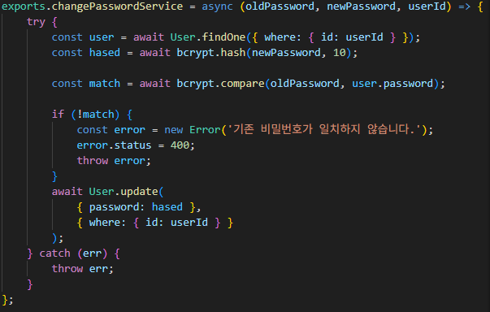
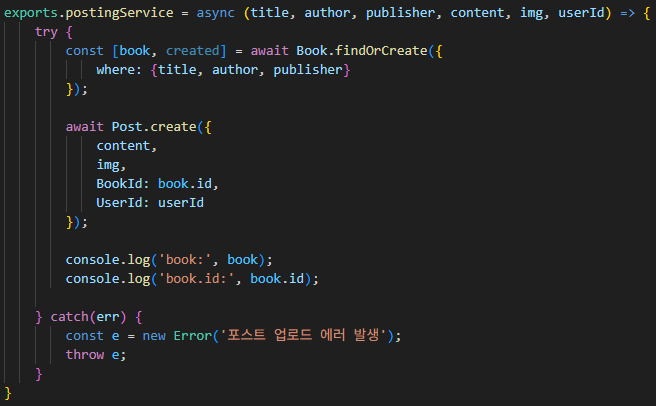

### booknote-platform
**사용자가 읽은 책의 감상문을 남길 수 있는 개인 독서 기록 플랫폼**
- 사용자가 읽은 책의 정보를 입력하고 감상문을 등록하여 다른 사람들과 공유할 수 있다.

### 기술 스택
- Backend: Node.js, Express.js
- Frontend: EJS (Embedded JavaScript Templates)
- ORM: Sequelize (MySQL)

### E-R 다이어그램

### 주요 코드

- 서버 실행 시 업로드 디렉토리를 자동 생성

- 사용자가 입력한 기존 비밀번호를 bcrypt로 검증해 본인 여부를 확인
- 새 비밀번호는 평문 저장 없이 해시 처리하여 다시 저장

- 책 정보는 Book 테이블에 분리 저장
- 게시글은 외래키로 참조하도록 설계해 데이터 중복 방지

### 주요 기능
| 기능 | 설명 |
|------|------|
| **도서 감상문 작성** | 책 제목, 저자, 출판사 정보를 입력하고 감상문을 작성하며 이미지도 첨부 가능 |
| **회원가입 및 로그인** | 사용자는 ID와 비밀번호로 회원가입 후 세션 기반 로그인 가능 |
| **닉네임 및 비밀번호 변경** | 사용자 설정 페이지에서 닉네임 및 비밀번호 변경 가능 |
| **게시글 업로드** | 감상문을 작성하여 데이터베이스에 저장하고 메인 페이지에 공유 |
| **게시글 목록 보기** | 메인 페이지에서 모든 사용자들의 감상문 확인 가능 |
| **내 게시글 관리** | 작성한 게시글만 필터링하여 수정 또는 삭제 가능 (권한 체크 포함) |
| **이미지 업로드** | 책 표지 이미지 등 사용자 첨부 이미지 파일 업로드 지원 (Multer 사용) |

---

### 화면 구성
- 메인 페이지
  
  
- 프로필 확인 페이지
  
  
- 업로드 페이지
  

- 게시글 확인 페이지
  

### 개발자
- 윤원준 
**GitHub**: [@WJ718](https://github.com/WJ718) 
**Email**: wjyoun6926@gmail.com
