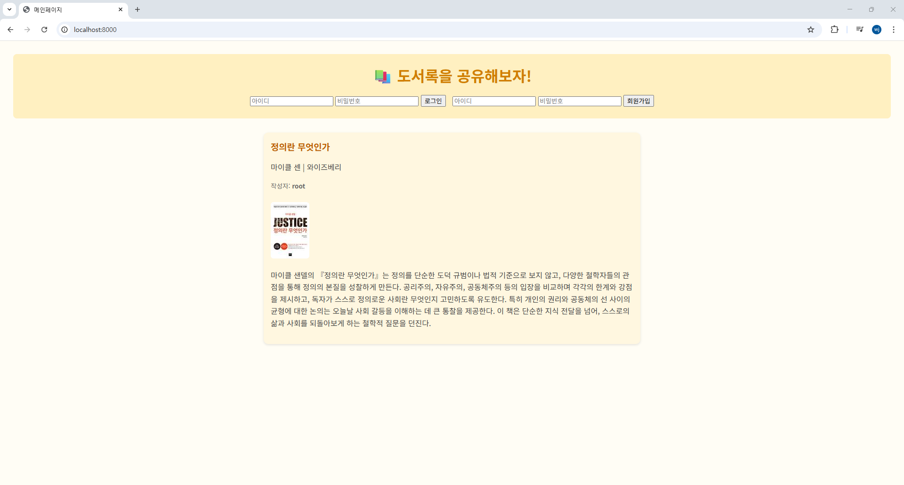
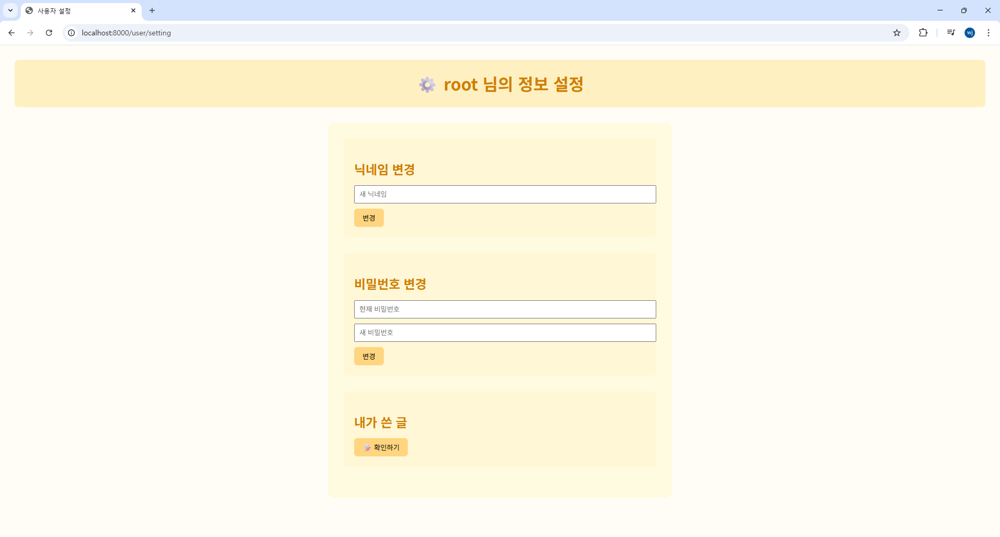
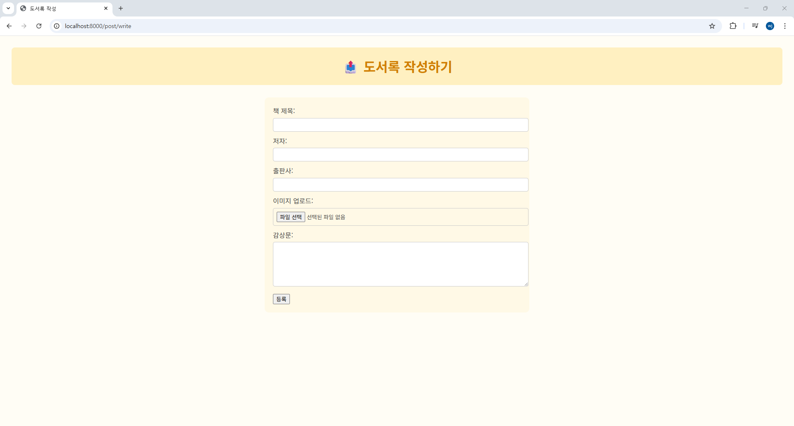
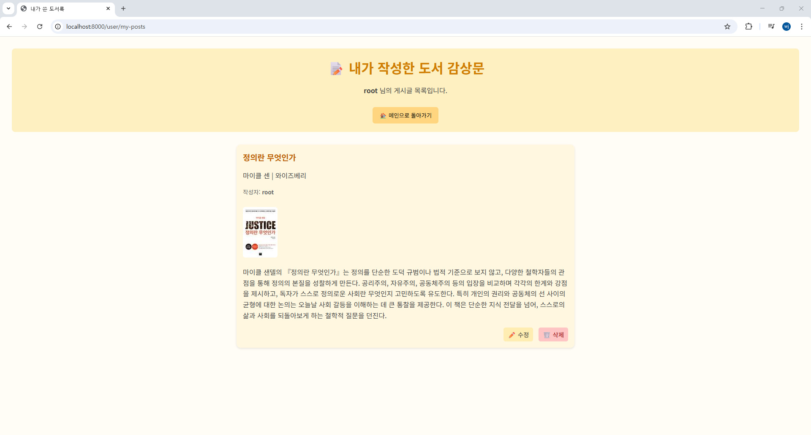

### booknote-platform
Node.js 기반 도서 감상 공유 웹 애플리케이션
- 사용자가 읽은 책의 정보를 입력하고 감상문을 등록하여 다른 사람들과 공유할 수 있습니다.  

### 기술 스택
- Backend: Node.js, Express.js
- Frontend: EJS (Embedded JavaScript Templates)
- ORM: Sequelize
- Database: MySQL
- Auth: express-session (세션 로그인 방식)
- File Upload: Multer (책 이미지 업로드 지원)

### 주요 기능
- 회원가입 및 로그인/로그아웃
- 닉네임 및 비밀번호 수정
- 도서 정보와 감상문 등록
- 이미지 첨부 기능 (책 표지 등)
- 내가 작성한 글 확인, 수정, 삭제
- 메인 페이지에 전체 게시글 목록 표시

### 화면 구성
- 메인 페이지
  
  
- 프로필 확인 페이지
  
  
- 업로드 페이지
  

- 게시글 확인 페이지
  
